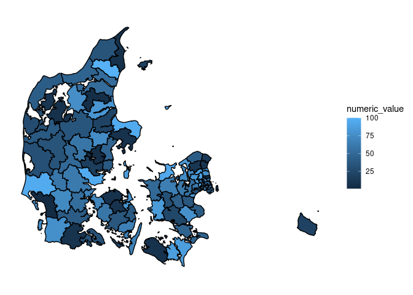
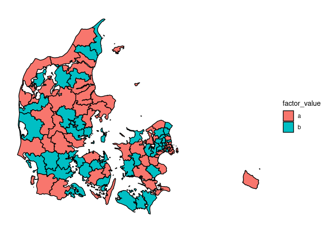
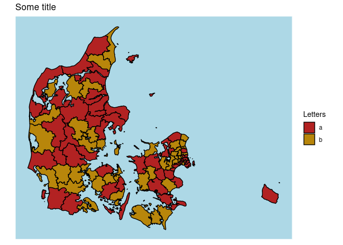
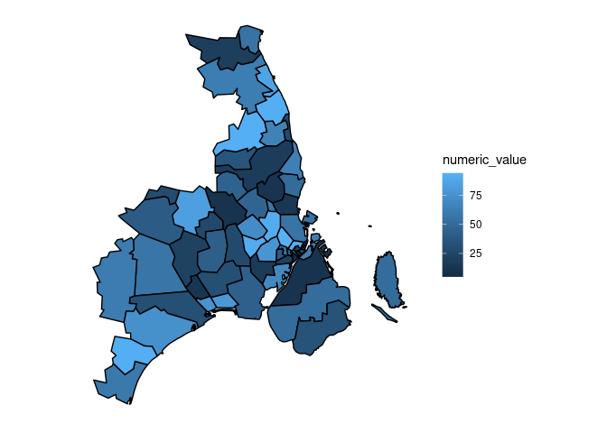
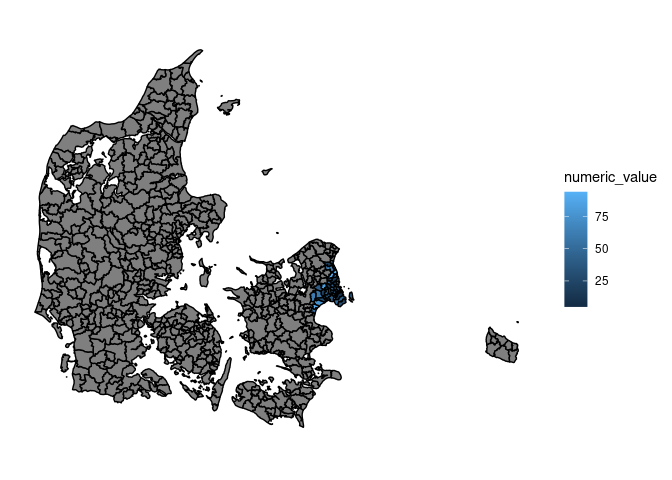

# plotDK

plotDK provides easy access to plot summary statistics as choropleth
maps of danish administrative areas. plotDK supports geoms for danish
regions, provices, municipalities, and zipcodes.

## Installation

You can install the released version of plotDK from
[CRAN](https://CRAN.R-project.org) with:

``` r
install.packages("plotDK")
```

or from github with:

``` r
devtools::install_github("https://github.com/kristianSN/plotDK")
```

## Empty maps

To simply show a choropleth map of a chosen administrative level (here
regions) invoke:

``` r
library(plotDK)

plotDK(plotlevel = "region")
```


Switching to plot municipalities is as simply as switching the plotlevel
to “municipality”:

``` r
plotDK(plotlevel = "municipality")
```


## Plotting summary statistics on municipalities

To fill the maps with values, first generate or load a data set
containing one row per entity, with a valid ID column and a value column
to be plotted. plotDK contains information of valid ID’s. For
municipalities this data is saved in:

``` r
plotDK::municipality_info
```

Here let’s generate a dataset with valid region ID’s and assign each
region a random numeric value:

``` r
valid_ids <- plotDK::municipality_info

municipality_data <- data.frame(
  municipality_name = valid_ids$municipality_names,
  numeric_value = sample(1:100, size = length(valid_ids$municipality_names), replace = TRUE),
  stringsAsFactors = FALSE
)

municipality_data[1:20,]
#>    municipality_name numeric_value
#> 1           aabenraa             8
#> 2            aalborg            52
#> 3                ærø            17
#> 4        albertslund           100
#> 5            allerød            89
#> 6             aarhus            47
#> 7             assens            59
#> 8           ballerup            45
#> 9            billund            60
#> 10          bornholm            20
#> 11           brøndby            28
#> 12       brønderslev           100
#> 13       christiansø            45
#> 14            dragør            98
#> 15            egedal            81
#> 16           esbjerg             1
#> 17   faaborg-midtfyn            36
#> 18              fanø            76
#> 19          favrskov            75
#> 20              faxe            78
```

Plotting these values on their municipalities is as simple as providing
the municipality data to plotDK(), while providing the names of the ID
and value variables:

``` r
plotDK::plotDK(
  data = municipality_data,
  id = "municipality_name",
  value = "numeric_value",
  plotlevel = "municipality"
)
```



The value scales depends upon the type of the value variable. That is
means if we try to plot a character or factor variable, the plot will
change accordingly:

``` r
municipality_data <- data.frame(
  municipality_name = valid_ids$municipality_names,
  factor_value = factor(sample(c("a", "b"), size = length(valid_ids$municipality_names), replace = TRUE)),
  stringsAsFactors = FALSE
)

plotDK::plotDK(
  data = municipality_data,
  id = "municipality_name",
  value = "factor_value",
  plotlevel = "municipality"
)
```



## ggplot compatability

The resulting plots are ggplot2-objects. This means that they can be
altered or styled with normal ggplot elements:

``` r
library(ggplot2)
p <- plotDK::plotDK(
  data = municipality_data,
  id = "municipality_name",
  value = "factor_value",
  plotlevel = "municipality"
)

p + 
  ggtitle("Some title") +
  scale_fill_manual(
    values=c("firebrick", "darkgoldenrod"),
    name = "Letters"
  ) + 
  theme(
    panel.background = element_rect(
      fill = "lightblue"
    )
  )
```



## Subplots

By default plotDK does not show missing entities. This means that
subplots can easily be drawn, by only providing a subset of entities in
the data:

``` r
zipcode_data <- plotDK::zipcode_info

zipcode_subset <- zipcode_data[zipcode_data$zipcode_numbers < 3000, , drop = FALSE]  

zipcode_subset$numeric_value <- sample(1:100, size = nrow(zipcode_subset), replace = TRUE)

p <- plotDK::plotDK(
  data = zipcode_subset,
  id = "zipcode_numbers",
  value = "numeric_value",
  plotlevel = "zipcode"
)
p
```



If you only have data on a subset of entities, but want the entire map
drawn, do this by passing the argument; show\_missing = TRUE:

``` r
p <- plotDK::plotDK(
  data = zipcode_subset,
  id = "zipcode_numbers",
  value = "numeric_value",
  plotlevel = "zipcode",
  show_missing = TRUE
)

p
```


